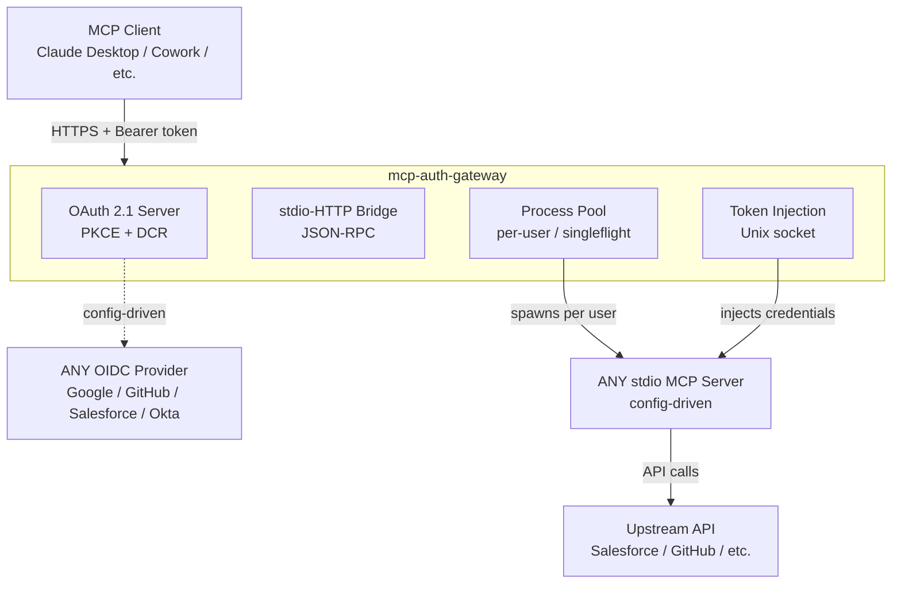

# mcp-auth-gateway

<p align="center">
  <strong>
    <a href="#quick-start">Getting Started</a>
    &nbsp;&nbsp;&bull;&nbsp;&nbsp;
    <a href="CONTRIBUTING.md">Contributing</a>
    &nbsp;&nbsp;&bull;&nbsp;&nbsp;
    <a href="https://github.com/nicknikolakakis/mcp-auth-gateway/issues">Get In Touch</a>
  </strong>
</p>

<p align="center">
  <a href="https://github.com/nicknikolakakis/mcp-auth-gateway/actions/workflows/test.yml?query=branch%3Amain">
    
  </a>
  <a href="https://goreportcard.com/report/github.com/nicknikolakakis/mcp-auth-gateway">
    
  </a>
  <a href="https://github.com/nicknikolakakis/mcp-auth-gateway/releases">
    
  </a>
  <a href="LICENSE">
    
  </a>
</p>

---

Generic authentication gateway for [MCP](https://modelcontextprotocol.io/) servers. Wraps any stdio-only MCP server with OAuth 2.1 authentication and exposes it over Streamable HTTP/SSE for remote access from Claude Desktop, Cowork, and other MCP clients.

## Why

Most MCP servers are designed to run locally via stdio. This makes them unusable for teams that need:

- **Centralized hosting** on Kubernetes or cloud infrastructure
- **Per-user authentication** via corporate SSO (Salesforce, Google, GitHub, Okta, Azure AD)
- **Process isolation** so each user gets their own MCP server instance
- **Audit logging** of who used which tools and when

No existing project combines all of these. mcp-auth-gateway fills this gap.

## Architecture



## Features

- **Config-driven**: YAML config for any OIDC provider and any stdio MCP server
- **OAuth 2.1**: PKCE, Dynamic Client Registration, token refresh (MCP spec compliant)
- **Per-user isolation**: Separate MCP process per authenticated user
- **Secure token delivery**: Unix domain socket injection (not env vars or files)
- **Observability**: Structured JSON logs, Prometheus metrics
- **Kubernetes-ready**: Distroless image, health probes, graceful shutdown

## Quick Start

### 1. Configure

```yaml
# config.yaml
gateway:
  base_url: "https://mcp.yourcompany.com"
  listen: ":8080"

oidc:
  issuer_url: "https://accounts.google.com"
  scopes: ["openid", "email"]
  user_id_claim: "sub"
  allowed_domains: ["yourcompany.com"]

mcp_server:
  command: "npx"
  args: ["-y", "@modelcontextprotocol/server-github"]
  token_delivery: "env"
  token_env_var: "GITHUB_PERSONAL_ACCESS_TOKEN"
```

### 2. Run

```bash
# Build
make build

# Run
./bin/mcp-auth-gateway --config config.yaml
```

### 3. Connect from Claude Desktop

```json
{
  "mcpServers": {
    "my-server": {
      "url": "https://mcp.yourcompany.com/mcp"
    }
  }
}
```

First connection opens a browser popup for SSO login. After that, it just works.

## Example Configs

<details>
<summary>Salesforce</summary>

```yaml
oidc:
  issuer_url: "https://login.salesforce.com"
  scopes: ["openid", "id", "api", "refresh_token"]
  user_id_claim: "sub"

mcp_server:
  command: "node"
  args: ["mcp-server/index.js"]
  token_delivery: "unix_socket"
  token_env_var: "SF_TOKEN_FD"
  extra_env:
    SF_INSTANCE_URL: "{{instance_url}}"

ssrf:
  validate_field: "urls.custom_domain"
  allowlist_regex: '^https://[a-z0-9-]+(\.(my|sandbox))?\.salesforce\.com(/.*)?$'
```

</details>

<details>
<summary>GitHub</summary>

```yaml
oidc:
  authorization_endpoint: "https://github.com/login/oauth/authorize"
  token_endpoint: "https://github.com/login/oauth/access_token"
  userinfo_endpoint: "https://api.github.com/user"
  scopes: ["read:user", "repo"]
  user_id_claim: "id"

mcp_server:
  command: "npx"
  args: ["-y", "@modelcontextprotocol/server-github"]
  token_delivery: "env"
  token_env_var: "GITHUB_PERSONAL_ACCESS_TOKEN"
```

</details>

<details>
<summary>Google Workspace</summary>

```yaml
oidc:
  issuer_url: "https://accounts.google.com"
  scopes: ["openid", "email", "profile"]
  user_id_claim: "sub"
  allowed_domains: ["yourcompany.com"]

mcp_server:
  command: "python"
  args: ["-m", "google_workspace_mcp"]
  token_delivery: "env"
  token_env_var: "GOOGLE_ACCESS_TOKEN"
```

</details>

## Development

```bash
make build        # Build binary
make test         # Run unit tests
make lint         # Run linter
make run          # Run with example config
```

## Community

- [Contributing Guide](CONTRIBUTING.md)
- [Code of Conduct](CODE_OF_CONDUCT.md)
- [Security Policy](SECURITY.md)
- [Governance](GOVERNANCE.md)
- [Roadmap](ROADMAP.md)

## License

Apache 2.0 - see [LICENSE](LICENSE).
